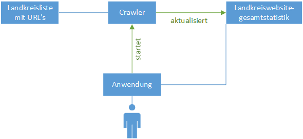

= Lastenheft
:project_name: GeoContentAnalyser
== __{project_name}__

[options="header"]
[cols="10%, 15%, 20%, 15%, 40%"]
|===
|Version| Status    | Bearbeitungsdatum | Autoren(en)    |  Vermerk
|0.1    | In Arbeit | 22.04.2023        | Leon Kunze     | Initiale Version
|===

== Systemziele
Das Lastenheft beschreibt die Anforderungen an die, durch den Auftragnehmer zu lieferndes
Softwaretool, zum ermitteln und statistisch auswertbar abzuspeichern von quantitative Daten 
zum Thema „Geo Content Management“. Zu einem dokumentierten Stichtag sollen die URL's der 
Landkreisliste laut Wikipedia importieren werden. Die Datum- und Uhrzeitangabe muss in einem 
Unterordner im Datenverzeichnis erzeuget werden. Anschließend wird eine Logdatei mit Datum 
und Uhrzeit für die Ergebniszusammenfassung angelegt. Dabei speichert die Datei in einer 
Tabelle alle Landkreise mit den aggregierten Ergebnissen je Landkreis. Daraufhin wird jede 
Landkreisseite mit zeitgesteuerten Crawler angesteuert. Infolgedessen wird eine Logdatei mit 
Datum und Uhrzeit für die Analysestatistik pro einzelner Landkreisinhaltsseite angelegt. Auf 
jede einzelne Seite der Landkreiswebsite sollen vorgegebene Inhalt erhoben werden. Nach dem 
Abschluss der Analyse der Landkreiswebsite wird die Gesamtstatistik aktualisiert. Zuletzt 
werden die Landkreiswebsitegesamtstatistik um weitere Metadatenfelder pro Datensatz 
angereichert.

== Funktionale Anforderungen
[options="header"]
[cols="15%, 40%, 35%, 10%"]
|===
|Nr./ID   | nichttechnischer Titel  | Verweise             | Priorität
|ANF_01   | zeitgesteuerter Crawler | Aufgabenstellung     |hoch
|===
Beschreibung

Ein zeitgesteuerter Crawler soll Inhalte von einzelnen, zuvor bestimmten, Seiten der 
Landkreiswebsite erheben. Dabei sollte der Crawler nicht als BOT identifiziert werden. 
Diese Daten werden in einer Logdatei hinterlegt und gespeichert.

[options="header"]
[cols="15%, 40%, 35%, 10%"]
|===
|Nr./ID   | nichttechnischer Titel  | Verweise             | Priorität
|ANF_02   | Landkreisliste          | Aufgabenstellung     |hoch
|===
Beschreibung

An einem Stichtag sollen die URL's der Landkreisliste importiert werden.

[options="header"]
[cols="15%, 40%, 35%, 10%"]
|===
|Nr./ID   | nichttechnischer Titel          | Verweise             | Priorität
|ANF_03   | Landkreiswebsitegesamtstatistik | Aufgabenstellung     |hoch
|===
Beschreibung

Eine Logdatei mit Datum und Uhrzeit soll angelegt werden. Diese Datei soll mit den erhobenen 
Daten aktualieiert werden.

[options="header"]
[cols="15%, 40%, 35%, 10%"]
|===
|Nr./ID   | nichttechnischer Titel          | Verweise             | Priorität
|ANF_04   | Extra Daten                     | Aufgabenstellung     |hoch
|===
Beschreibung

Die Logdatei soll mit zusetzlichen, vorher bestimmten Metadatenfeldern pro Datensatz 
angereichert werden.

== Nichtfunktionale Anforderungen
Besonderen Wert sollte auf folgende Eigenschaften der Software gelegt werden:

    a. Benutzbarkeit: Sobald das Softwaretool gestartet wird, sollen die gewünschten Daten 
    erhoben werden.

    b. Zuverlässigkeit: Das Softwaretool soll immer verfügbar sein.

    c. Effizienz und Antwortzeitverhalten: Das Softwaretool kann ein höheres 
    Antwortzeitverhalten aufweisen.

    d. Änderbarkeit: Die Logdatei soll beim nutzen des Softwaretools stets aktualisiert 
    werden.

    e. Übertragbarkeit: Das Softwaretool soll Betriebssystemunabhängig sein und auf 
    verschiedensten Systemen laufen.

    f. Wartbarkeit: Man soll in der Lage sein, dass Softwaretool zu erweitern und Fehler zu 
    beheben.

== Benutzerschnittstelle

[[Skizze_Systemarchitektur]]
