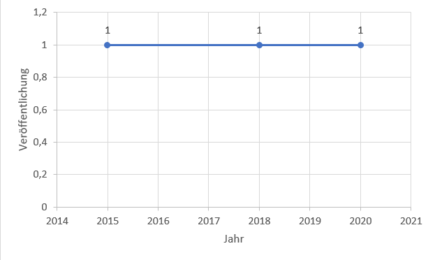

= Literature Search
:project_name: GeoContentAnalyser
== __{project_name}__

[options="header"]
[cols="10%, 15%, 20%, 15%, 40%"]
|===
|Version| Status    | Bearbeitungsdatum | Autoren(en)    |  Vermerk
|0.1    | In Arbeit | 05.07.2023        | Leon Kunze     | Initiale Version
|1.0    | Finale Version | 05.07.2023        | Leon Kunze     | Finalisierung
|===

== Planung

Die Review, die wir durchführen wird hauptsächlich mit hilfe von Google Scholar gemacht.
Wir verwendeten die Schlüsselwörter "geo-content management system", in verschiedensten Schreibweisen,
"government", "Geocms" und "Website". Die Suchergebnisse, die entdeckt wurden, beschränkten sich dadurch
auf 55 Papers.
Anschließend beschrieben wir die Einschluss- und Ausschlusskriterien. In betrachtnahme der Forschungsfrage,
werden alle Artikel in betracht gezogen, welche sich mit dem Thema "Geo Content Management" befasst.
Das Ziel dieser Literaturesuche ist es, die Aussagen, die in der Literatur getroffen werden, zum Thema
"Geo Content Management", mit der Statistik, die wir mittels unserem Programmes erhoben haben, 
gegenüberzustellen. Das Einschlusskriterium war, dass sich mit dem Thema "Geo Content Management" befasst
wird und, dass die Papers im Zeitraum von 2012 bis 2023 erschienen sind. Papers die nicht in Deutsch oder 
Englisch sind, eine Master- oder Bachelorarbeit sind, und nicht frei erhältlich sind, wurden als 
Ausschlusskriterium bestimmt. 

.Evaluationskriterien
[options="header"]
[cols="50%, 50%"]
|===
|Forschungsfragen   |Evaluationskriterien 
|RQ 1               |Verwendungszweck der GeoCMS
|RQ 2               |Beispiele für GeoCMS
|===

Im letzten Abschnitt der ersten Phase definieren wir eine Gruppe von Analysekategorien, mit ensprechenden 
Unterkategorien, in Abhängigkeit zur Forschungsfrage. Diese Kategorien enthalten die Evaluationskriterien,
die in verwendet wurden, um die Studien auszuwählen. Sie helfen uns außerdem die Studien mit gleichen
Charakteristiken zu gruppieren. Die Liste der Evaluationskriterien für das extrahieren der Daten sind in
Tabelle 1 zu sehen.

== Durchführung

Alle 55 Papers, aus der ersten Phase, wurden auf Relevanz untersucht. Dadurch wurden von den 55 Papers 52 
ausgeschlossen. Somit werden die 3 verbleibenden Papers für die Review verwendet. Von den 3 Papers ist 
eine Bachelorarbeit, eine Masterarbeit und vier Artikel. 
Zuerst wurd das Veröffentlichungsjahr in betracht gezogen. Das Veröffentlichungsjahr ist das Jahr in dem 
die Arbeiten oder Artikel verüffentlicht wurden und reicht von 2015 bis 2020.
Abb. 1 zeigt die Anzahl der Studien im Verhältnis zum Veröffentlichungsjahr. Dabei ist festzuhalten, dass 
Jeder Studie in einem unterschiedlichen Jahr veröffentlicht wurde. Da jedoch nur 3 Studien verwendet 
wurden, kann aufgrund der geringen Anzahl keine Schluss gezogen werden.

[[Veröffentlichungen_Jahr]]

== Report

=== Verwendungszweck der GeoCMS

Das erste Evalutationskriterium mit dem wir uns in dieser Review befassen ist der Verwendungszweck von 
GeoCMS. Nach dem extrahieren der Daten von den Studien wurden die genannten Anwendungsfälle in einer 
Tabelle (Tabelle 2) aufgeführt. Dabei ist zu bemerken, dass beim erstellen der GeoCMS immer ein Wert 
darauf gelegt wurde, dass sowohl der Staat als auch der normale Nutzer zugriff auf die Daten hat.
Sehr häufig wurde in den Studien von Naturkatastrophen wie zum Beispiel Vulkanausbrüche, Erdruch, Stürme 
und Erbeben geschrieben[2] und wie GeoCMS helfen sich auf diese Katastrophen vorzubereiten.
Ein weiterer Verwendungszweck ist die Infrastruktur wie zum Beispiel Straßenbau, Bau von neuen Gebäuden 
und  ähnliches. Mit Zugriff auf Geodaten ist es möglich sich die Landschaft vornerein anzugucken und 
dementsprechend zu planen.

.Verwendungszweck
[options="header"]
[cols="40%, 10%, 50%"]
|===
|Kategorie                      |Häufigkeit     |Beispielstudie
|Infrastruktur                  |2              |Md. Mostafizur Rahman et al., 2020
|Naturkatastrophenbewältigung   |2              |Simonette Lat et al., 2015
|Öffentlicher Nutzen            |3              |Md. Mostafizur Rahman et al., 2020
|===

=== Beispiele für GeoCMS

Tabelle 3 zeigt eine Auflistung von, in den Studien erwähnten, GeoCMS. Das GeoCMS, welches von jeder 
Studie erwähnt wurde, war GeoNode. GeoNode ist einer der bekanntesten GeoCMS und verschiedenste GeoCMS
bauen auf GeoNode wie zum Beispiel LiPAD, GeoDASH und Harvard WorldMap.
Die soeben genannte GeoCMS LiPAD, GeoDASH und Harvard WorldMap wurden entweder von einem Staat 
gefördert, von einem Staat übernommen oder von einer Universität erstellt. Zum Beispiel wurde GeoDASH 
vom Staat Bangladesh als offizieler GeoCMS übernommen.
Ebenfalls wurde erwähnt auf welcher Programmiersprache manche GeoCMS aufbauen (Tabelle 
4).

.GeoCMS
[options="header"]
[cols="40%, 10%, 50%"]
|===
|Kategorie                      |Häufigkeit     |Beispielstudie
|GeoNode                        |3              |Md. Mostafizur Rahman et al., 2020
|Hypermap Registry              |1              |Paolo Corti et al., 2018
|Joomla                         |1              |Paolo Corti et al., 2018
|Cartaro                        |1              |Simonette Lat et al., 2015
|Wordpress                      |1              |Paolo Corti et al., 2018
|GeoDASH                        |1              |Md. Mostafizur Rahman et al., 2020
|Drupal                         |1              |Paolo Corti et al., 2018
|ArcGIS Online                  |1              |Simonette Lat et al., 2015
|Liferay                        |1              |Paolo Corti et al., 2018
|MapIgniter                     |1              |Simonette Lat et al., 2015
|Plone                          |1              |Paolo Corti et al., 2018
|Django CMS                     |1              |Paolo Corti et al., 2018
|LiPAD                          |1              |Simonette Lat et al., 2015
|Harvard WorldMap               |1              |Paolo Corti et al., 2018
|===

.Verwendungszweck
[options="header"]
[cols="40%, 10%, 50%"]
|===
|Programmiersprache     |Häufigkeit     |%
|PHP                    |3              |21,4%
|Java                   |1              |7,1%
|Python                 |2              |14,3%
|nicht genannt          |8              |57,1%
|===

== Zusammenfassung

In dieser Untersuchung wurden Reviews zum Theme Geo-Content-Management-Systeme abgehalten. Dabei wurden 
Studien im in betracht gezogen, welche frei erhältich waren, und sich mit dem Thema GeoCMS befasst haben.
Allgemeine Reviews für GeoCMS fokusieren sich auf die Entwicklung von GeoCMS auf speziefische Fälle. Dabei 
gibt es eine Abwesenheit von Reviews, die sich einzig auf die Anwendung von GeoCMS beziehen. Die 
identifizierten Forschungslücken sind i) die Anwendung von einem GeoCMS an einem spezifischen 
Verwendungszweck und dadurch erhoben Daten; und ii) erheben von Geodaten auf Websites mittels einer 
Software und Statistische auswertung dieser.
Entwicklung von GeoCMS ist: i) einer GeoCMS Plattform, die die Inhalter von verschiedenen GeoCMS 
zusammenbringt; ii) die Entwicklung und Designentscheidung eines GeoCMS; und iii) Verwendung von GeoCMS im 
Rahmen von Denkmälern. GeoCMS sind sehr in verschiedenen Aspekten wie zum Beispiel Ausbau der Infrastruktur. 
Im Laufe der Suche nach Studien ist uns aufgefallen, dass es in den letzten 2 Jahren kein großer Anstieg 
an Studien gabe. Um genauer zu sein wurden nur 2 neue Studien im Zeitraum von 2022 bis 2023 veröffentlicht. 
Um eine vollständige Review zu dem Thema zu geben, wir haben Artikel veröffentlicht von 2012 bis 2023 
angesammelt. Ein gesammte Zahl von 3 Artikeln und Konferenzpapieren, welche relevant zum Thema waren, wurden,
aufgrund der Einschlusskriterien, ausgewählt und ausgewertet. Zukünftige Untersuchungen könnten noch 
Master- und Bachelorarbeiten in die Auswertung hinzufügen, so wie Bücher, die vorher gekauft werden müssten, 
als auch andere Datenbanken nutzen anstelle von Google Scholar. Dies kann gemacht werden um ein weiteres 
Spektrum an Studien zu bekommen und damit man sich eine bessere Meinung machen kann.

== Referenzen

[1]Paolo Corti, Benjamin Lewis & Athanasios Tom Kralidis, "Hypermap registry: an open source, standards-based geospatial registry and search platform", 2018
[2]Simonette Lat, Ruby Ann Marie Magturo, Mark Edwin Tupas, Enrico Paringit, Kenneth Langga, Ernanie Marin, Joyce Anne Laurente, "LiDAR DATA DISTRIBUTION USING LiPAD, AN OPEN-SOURCE BASED LiDAR PORTAL FOR ARCHIVING AND DISTRIBUTION", 2015
[3]Md. Mostafizur Rahman, György Szabó, "NATIONAL SPATIAL DATA INFRASTRUCTURE (NSDI) OF BANGLADESHDEVELOPMENT, PROGRESS AND WAY FORWARD", 2020